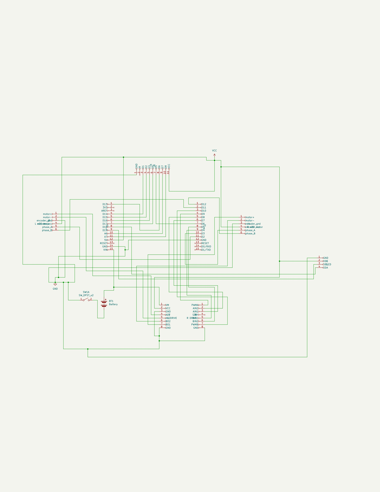
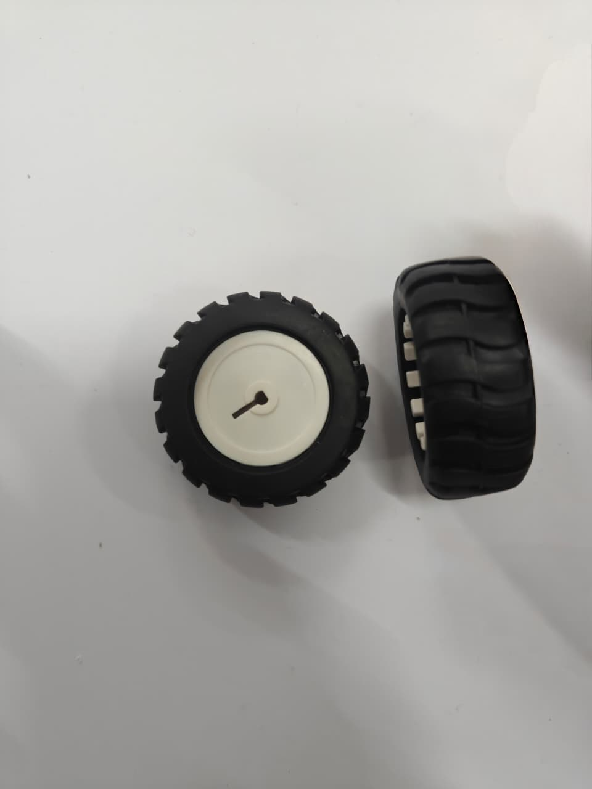
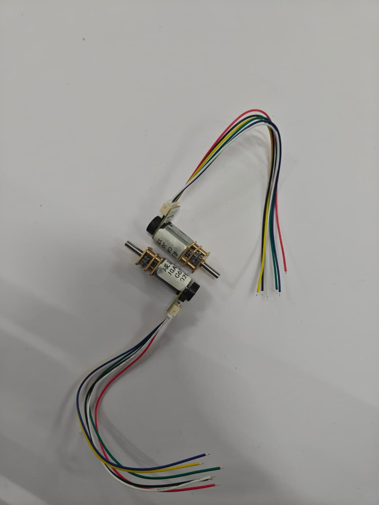
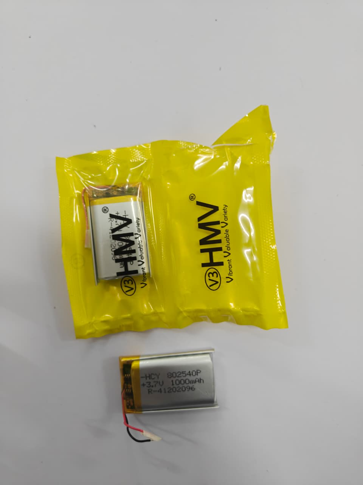
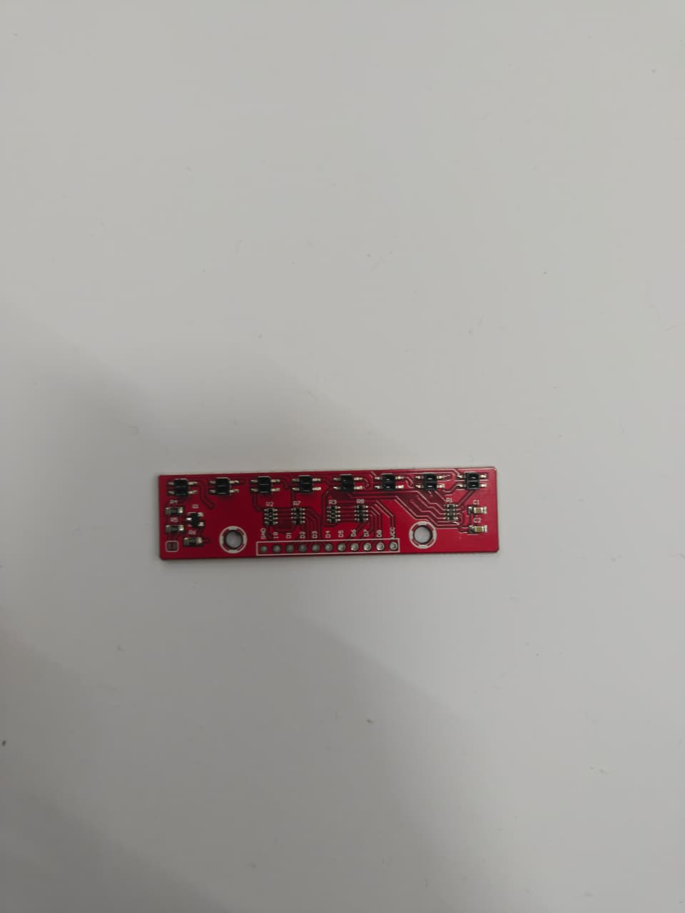
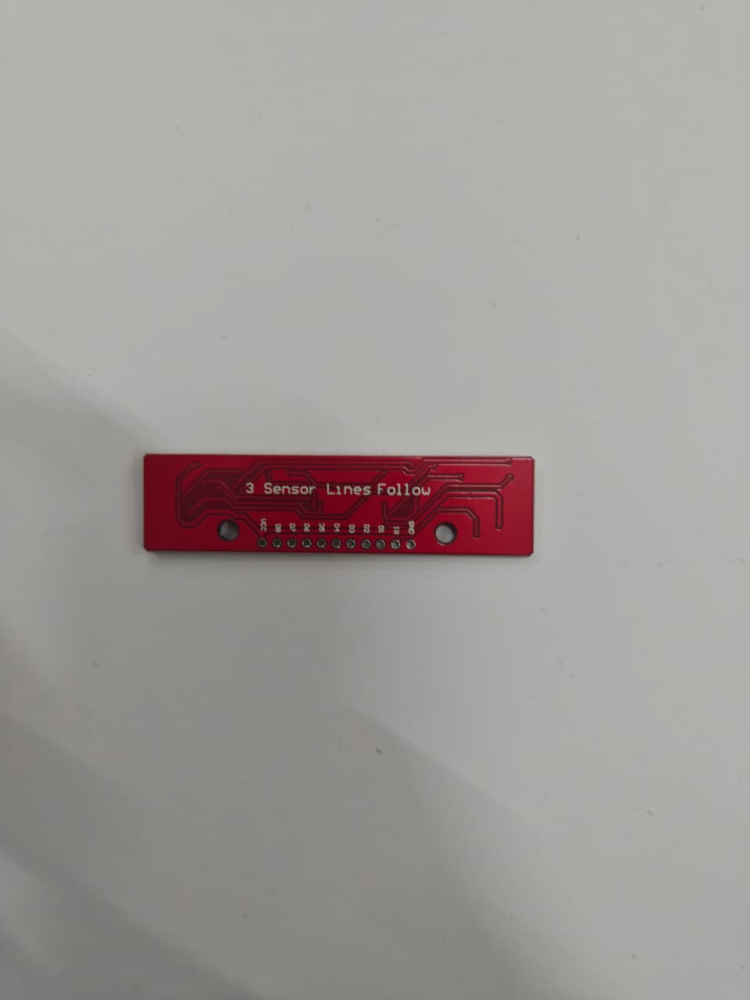

<h1 align="center">MazeSolver-Nano-2026 🏎️💨</h1>

A high-performance line-following and maze-solving robot built on the Arduino Nano platform. This project utilizes PID control and magnetic encoders for precision navigation.


## 🛠 Hardware Design Phase
I have received the core mechanical components (N20 motors, wheels) and the sensor array. 
The project is currently in the **Schematic Design** phase, focusing on:
- **Power regulation:** Implementing a Buck Converter to step down battery voltage for the Arduino Nano and sensors.
- **H-Bridge logic:** Integrating the TB6612FNG driver for efficient motor control.
- **Encoder routing:** Mapping magnetic encoder signals to interrupt pins for precise PID feedback.

## 👥 Development Team
* **Kavy Ondhia** (@Kavy-Ondhia) - Firmware Architecture & Logic
* **Karunya Jajoo** (@karunya-jajoo) - Hardware Schematic & PCB Design

## 🛠 Hardware Specifications

| Component | Purpose | Datasheet/Reference |
| :--- | :--- | :--- |
| **Arduino Nano** | Main Controller | [Official Manual](https://docs.arduino.cc/resources/datasheets/A000005-datasheet.pdf) |
| **TB6612FNG** | Motor Driver | [Toshiba Datasheet](https://www.sparkfun.com/datasheets/Robotics/TB6612FNG.pdf) |
| **N20 Motors** | 6V 200RPM w/ Encoders | [Technical Specs](https://www.handsontec.com/dataspecs/motor/N20-Motor.pdf) |
| **QTR-8RC** | IR Sensor Array | [Pololu Documentation](https://www.pololu.com/docs/0J12) |
| **SSD1306 OLED** | Debugging Display | [Adafruit Datasheet](https://cdn-shop.adafruit.com/datasheets/SSD1306.pdf) |
| **HC-05** | Bluetooth Module | [HC-05 Datasheet](https://components101.com/sites/default/files/component_datasheet/HC-05-Datasheet.pdf) |
| **LM2596 Buck** | 5V Regulation | [TI Datasheet](https://www.ti.com/lit/ds/symlink/lm2596.pdf) |

## 🔌 Proposed Pin Mapping (Nano)
*This table serves as the "contract" for the schematic design.*

| Standard Pin | KiCad Symbol Label | Component | Function | Status vs. Old |
| :--- | :--- | :--- | :--- | :--- |
| **D2** | D2 (Right Pin 11) | Encoder Left | Interrupt A (Phase A) | UNCHANGED |
| **D11** | D11 (Right Pin 2) | Encoder Left | Phase B (Dir Tracking) | UNCHANGED |
| **D3** | D3 (Right Pin 10) | Encoder Right | Interrupt B (Phase A) | UNCHANGED |
| **D12** | D12 (Right Pin 1) | Encoder Right | Phase B (Dir Tracking) | UNCHANGED |
| **D4** | D4 (Right Pin 9) | TB6612 (BIN1) | Right Motor Dir | UNCHANGED |
| **D5** | D5 (Right Pin 8) | TB6612 (BIN2) | Right Motor Dir | UNCHANGED |
| **D7** | D7 (Right Pin 6) | TB6612 (AIN1) | Left Motor Dir | UNCHANGED |
| **D8** | D8 (Right Pin 5) | TB6612 (AIN2) | Left Motor Dir | UNCHANGED |
| **D9** | D9 (Right Pin 4) | TB6612 (PWMA) | Left Motor Speed (PWM) | UNCHANGED |
| **D10** | D10 (Right Pin 3) | TB6612 (PWMB) | Right Motor Speed (PWM) | UNCHANGED |
| **A0** | D14 (Left Pin 4) | QTR-8RC Pin 1 | IR Reflectance | UNCHANGED |
| **A1** | D15 (Left Pin 5) | QTR-8RC Pin 2 | IR Reflectance | UNCHANGED |
| **A2** | D16 (Left Pin 6) | QTR-8RC Pin 3 | IR Reflectance | UNCHANGED |
| **A3** | D17 (Left Pin 7) | QTR-8RC Pin 4 | IR Reflectance | UNCHANGED |
| **D6** | D6 (Right Pin 7) | QTR-8RC Pin 5 | IR Reflectance | UNCHANGED |
| **A4** | D18 (Left Pin 8) | QTR-8RC Pin 6 | IR Reflectance | **MOVED** (From D13) |
| **A5** | D19 (Left Pin 9) | QTR-8RC Pin 7 | IR Reflectance | **MOVED** (From A6) |
| **D13** | D13 (Left Pin 1) | QTR-8RC Pin 8 | IR Reflectance | **MOVED** (From A7) |
| **D0** | D0 (RX) | NOT USED | Leave Empty for Uploads | **REMOVED** (Finish LED) |
| **A6 / A7** | A6 / A7 | NOT USED | Hardware Input Only | **VOID** |

### ⚠️ Critical Hardware Notes
* **A6/A7 Pins:** These pins on the Nano are **Analog Input Only**. They cannot be used for the QTR-8RC or Motor Standby because they cannot function as Digital Outputs.
* **QTR-8RC Version:** This project uses the **RC (Digital)** version of the sensor. Pins are toggled as outputs to charge the onboard capacitor, then read as inputs to measure discharge time.
* **USB Uploading:** Digital Pin **D0 (RX)** is left disconnected to prevent serial communication conflicts during code uploading.

## 🛠 Hardware Design


[Download PDF Version](hardware/schematic/Schematic_pdf/Schematic_v1.2.pdf)

## 🧠 Software Logic & Path Optimization

The robot's intelligence is divided into three layers: **Perception**, **Control**, and **Strategy**.

### 1. Perception & Control (PID)
* **The Error:** Using the QTR-8RC, we calculate the robot's position relative to the center (3500). 
    * $Error = 3500 - \text{Current Reading}$
* **PID Math:** We use Proportional (Muscle) and Derivative (Brakes) logic to calculate correction.
    * `Correction = (Kp * error) + (Kd * (error - lastError))`
    * `LeftSpeed = Base + Correction` | `RightSpeed = Base - Correction`

### 2. The Discovery Phase (Dry Run)
The robot uses a **Preferential Wall-Following Rule** (Straight > Left > Right). 
* **The Log:** Every move is recorded in a memory array.
* **Encoder Mapping:** Encoders track distance in millimeters to ensure precise turns and junction detection.

### 3. Path Optimization (The "Aha!" Moment)
The robot simplifies its recorded path by removing dead ends (represented as 'B' for Back).
* **Logic:** `Left -> Back -> Left` is simplified to `Straight`.
* **Optimization Example:** `L -> B -> L` becomes `S`. This "shrinks" the journey for the final run.

### 4. Advanced Mapping & Exploration
To cover the entire map, the robot utilizes a coordinate-based Node system:
```cpp
struct Node {
  long x;           // X coordinate from encoders
  long y;           // Y coordinate from encoders
  bool visited[3];  // [Left, Straight, Right]
  int parentNode;   // Back-tracking reference
};
```

## 📸 Component Gallery
<p align="center">
  
  
  
</p>
<p align="center">
  
  
</p>

## 📂 Project Structure
* `/src`: Final Arduino (.ino) and configuration (.h) files.
* `/hardware`: Schematic diagrams and PCB layouts (In Progress).
* `/media`: Component photos and project progress shots.

---
*Created by [Kavy Ondhia](https://github.com/Kavy-Ondhia)*
